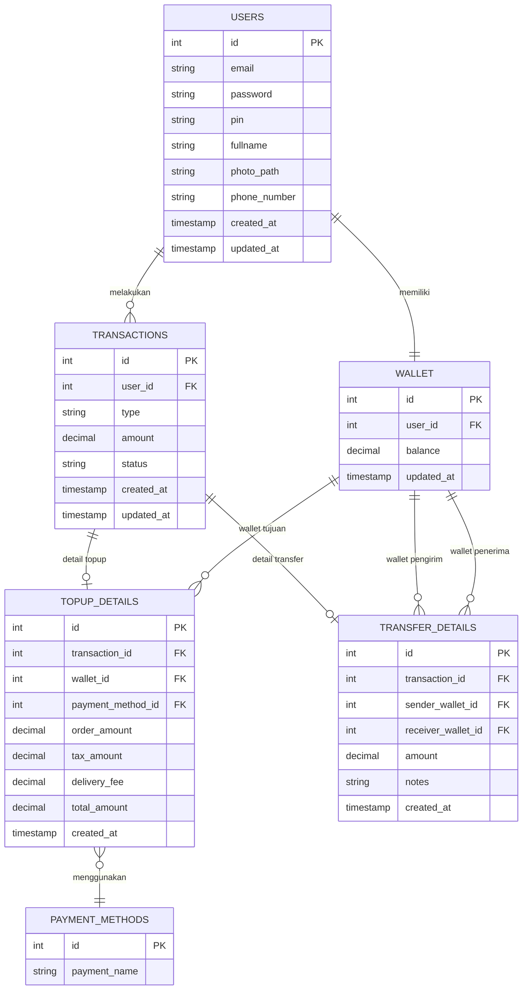

```mermaid
erDiagram

  USERS {
    int id PK
    string email
    string password
    string pin
    string fullname
    string photo_path
    string phone_number
    timestamp created_at
    timestamp updated_at
  }

  WALLET {
    int id PK
    int user_id FK
    decimal balance
    timestamp updated_at
  }

  TRANSACTIONS {
    int id PK
    int user_id FK
    string type
    decimal amount
    string status
    timestamp created_at
    timestamp updated_at
  }

  TOPUP_DETAILS {
    int id PK
    int transaction_id FK
    int wallet_id FK
    int payment_method_id FK
    decimal order_amount
    decimal tax_amount
    decimal delivery_fee
    decimal total_amount
    timestamp created_at
  }

  TRANSFER_DETAILS {
    int id PK
    int transaction_id FK
    int sender_wallet_id FK
    int receiver_wallet_id FK
    decimal amount
    string notes
    timestamp created_at
  }

  PAYMENT_METHODS {
    int id PK
    string payment_name
  }

  USERS ||--|| WALLET : "memiliki"
  USERS ||--o{ TRANSACTIONS : "melakukan"
  TRANSACTIONS ||--o| TOPUP_DETAILS : "detail topup"
  TRANSACTIONS ||--o| TRANSFER_DETAILS : "detail transfer"
  TOPUP_DETAILS }o--|| PAYMENT_METHODS : "menggunakan"
  WALLET ||--o{ TOPUP_DETAILS : "wallet tujuan"
  WALLET ||--o{ TRANSFER_DETAILS : "wallet pengirim"
  WALLET ||--o{ TRANSFER_DETAILS : "wallet penerima"

```