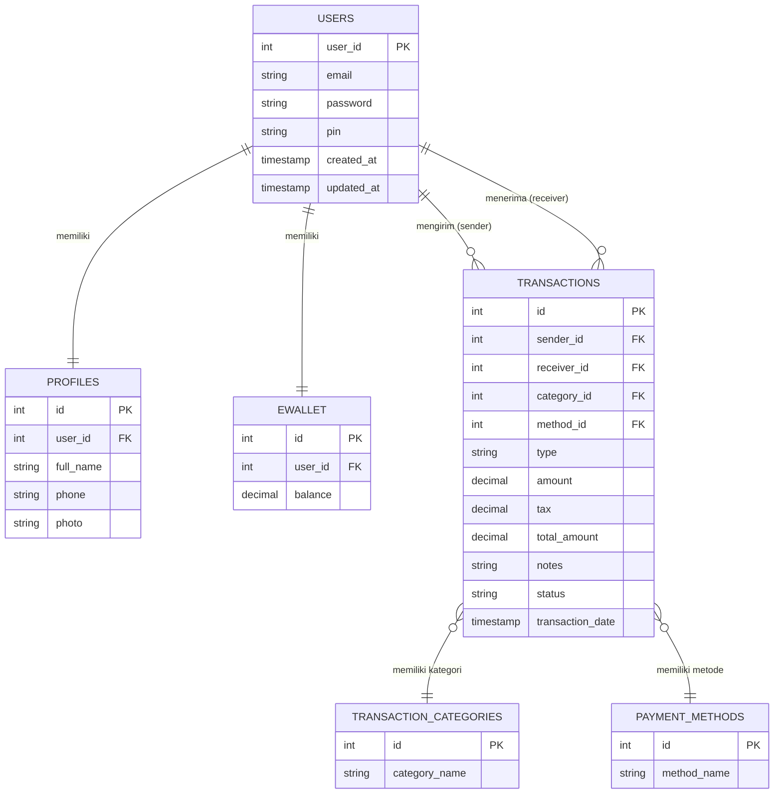

## ERD (Entity Relationship Diagram)

```mermaid
erDiagram
    USERS {
        int user_id PK
        string email
        string password
        string pin
        timestamp created_at
        timestamp updated_at
    }

    PROFILES {
        int id PK
        int user_id FK
        string full_name
        string phone
        string photo
    }

    EWALLET {
        int id PK
        int user_id FK
        decimal balance
    }

    TRANSACTIONS {
        int id PK
        int sender_id FK
        int receiver_id FK
        int category_id FK
        int method_id FK
        string type
        decimal amount
        decimal tax
        decimal total_amount
        string notes
        string status
        timestamp transaction_date
    }

    TRANSACTION_CATEGORIES {
        int id PK
        string category_name
    }

    PAYMENT_METHODS {
        int id PK
        string method_name
    }

    USERS ||--|| PROFILES : "memiliki"
    USERS ||--|| EWALLET : "memiliki"
    USERS ||--o{ TRANSACTIONS : "mengirim (sender)"
    USERS ||--o{ TRANSACTIONS : "menerima (receiver)"
    TRANSACTIONS }o--|| TRANSACTION_CATEGORIES : "memiliki kategori"
    TRANSACTIONS }o--|| PAYMENT_METHODS : "memiliki metode"


```